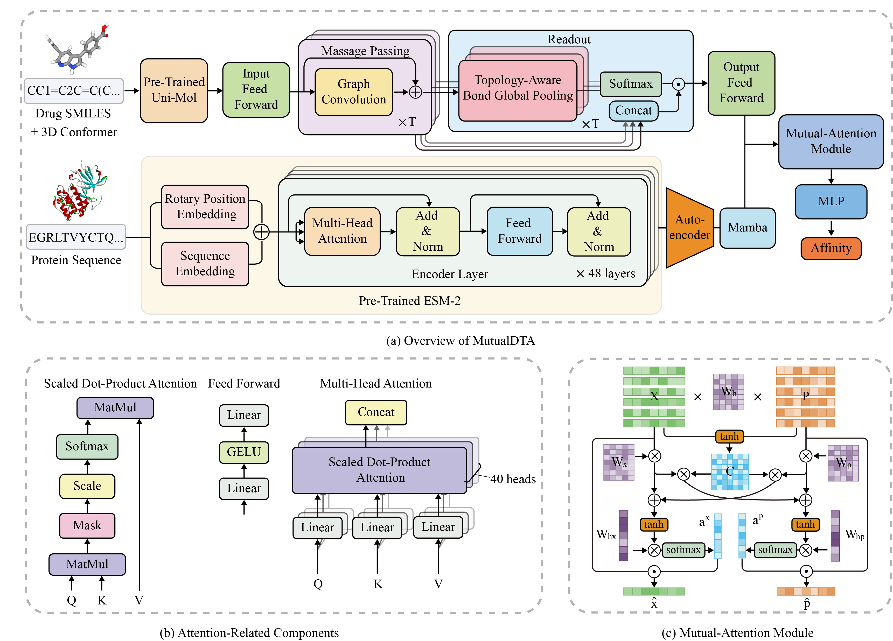

# MutualDTA: an interpretable drug-target affinity prediction model leveraging pre-trained models and Mutual-Attention



## Highlights

* Integrate large-scale pre-trained molecular and protein models for DTA prediction.
* Construct a substructure-aware D-MPNN for extracting drug substructures.
* Identify drug-target interaction sites through the Mutual-Attention module.
* Apply to Alzheimer's disease, aiding in the identification of high-affinity drugs.


## How to Run the Code
### 1. Environment Setup
Use Conda to create a virtual environment:

```bash
conda create -n MutualDTA python=3.10
conda activate MutualDTA
pip install -r requirements.txt
```

#### Mamba Installation
We recommend installing Mamba from the release files to avoid issues commonly encountered with pip.

- [Mamba GitHub Release](https://github.com/state-spaces/mamba/releases)
- [Causal-conv1d GitHub Release](https://github.com/Dao-AILab/causal-conv1d/releases)

The specific files used are:

```
causal_conv1d-1.4.0+cu118torch2.0cxx11abiFALSE-cp39-cp39-linux_x86_64.whl
mamba_ssm-2.2.2+cu118torch2.0cxx11abiFALSE-cp39-cp39-linux_x86_64.whl
```
You may select specific files based on your machine's configuration.

#### Encounter Difficulties
If you encounter difficulties installing Mamba, refer to the GitHub issues page for troubleshooting.

If you see an error like this:

```log
  File "/home/chensm22/miniconda3/envs/mamba/lib/python3.9/site-packages/mamba_ssm/ops/triton/ssd_combined.py", line 779, in forward
    causal_conv1d_cuda.causal_conv1d_fwd(rearrange(xBC, "b s d -> b d s"),
    ...
RuntimeError: causal_conv1d with channel last layout requires strides (x.stride(0) and x.stride(2)) to be multiples of 8
```

Add `.contiguous()` after the `rearrange()` function, like this: `rearrange(xBC, "b s d -> b d s").contiguous()`.


### 2. Preprocessing the Data

1. **Split Training and Testing Data:**


  ```bash
  python datahelper/split_train_test_data.py
  ```

2. **Obtain Pretrained Protein Representations:**

  ```bash
  python protein_representation_preprocessing.py
  ```

  After processing, remove any temporary protein files with:

  ```bash
  rm -r ./data/davis/proteins/
  ```

  This step requires significant memory—around 70GB of VRAM. If your GPU lacks this capacity, set a very small batch size and save protein representations to disk. Alternatively, you can perform inference on a CPU.

3. **Encode Protein Representations Using Sparse Autoencoder:**


  ```bash
  python protein_representation_preprocessing.py
  ```

4. **Generate Molecular Graph Representations:**


  ```bash
  python molecular_graph_preprocessing.py
  ```

### 3. Run the code
```bash
python main.py --dataset 'davis'
```

